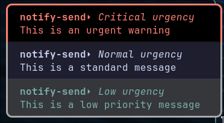
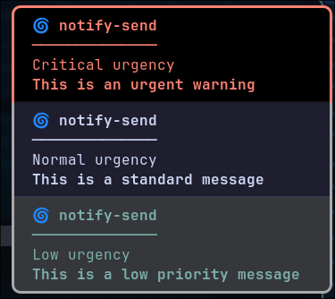
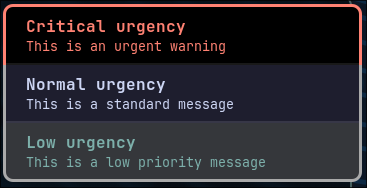
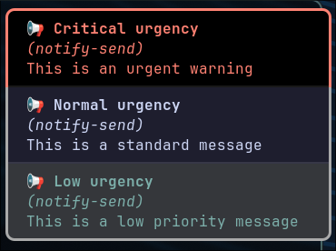
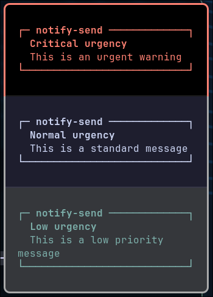
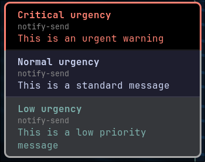

# 🔔 Dunst Configuration

This directory contains my **Dunst** configuration — a lightweight and highly customizable notification daemon for Linux.

---

## ⚙️ Overview

**Dunst** handles desktop notifications with minimal resource usage and flexible styling options.
This setup is designed for a **clean, centered, and minimal notification look**, integrating seamlessly with my Hyprland and Wayland environment.

---

## 📂 Structure

```
dunst/
├── .config/
│   └── dunst/
│       ├── dunstrc           # Main configuration file
```

---

## 🧩 Installation & Linking

If you manage your dotfiles with **GNU Stow**, link the configuration from your dotfiles root directory (e.g. `~/Dotfiles`):
```bash
stow dunst
```

This will symlink the config directory as:
```
~/.config/dunst -> Dotfiles/dunst/.config/dunst
```

To remove the symlink:
```bash
stow -D dunst
```

---

## 🎨 Customization Highlights

* **Font & Colors** – Matches overall system theme for consistency.
* **Transparency & Padding** – Subtle transparency and padding for better readability.
* **Notification Placement** – Appears at the top-right (or custom position set in `geometry`).
* **Timeouts** – Tuned for readable durations without lingering too long.
* **Icons** – Optionally replaced with custom symbolic icons.

Example snippet:

```ini
[global]
font = JetBrainsMono Nerd Font 10
width = 320
height = (0, 320)
origin = top-right
offset = (10, 50)
transparency = 10
frame_width = 2
separator_height = 1
format = "<b>%s %p</b>\n%b"

[urgency_low]
background = "#1e1e2e"
foreground = "#cdd6f4"

[urgency_normal]
background = "#181825"
foreground = "#f5e0dc"

[urgency_critical]
background = "#f38ba8"
foreground = "#1e1e2e"
frame_color = "#f38ba8"
```

**Some unique formats**

```
# App Name + Title + Body
# format = "<b>%a</b>⏵ <i>%s</i>\n%b"
```


```
# Boxed / Divider Style
# format = "🌀 <b>%a</b>\n──────────────\n%s\n<b>%b</b>"
```


```
# Minimal Modern Style
# format = "<b>%s</b>\n<small>%b</small>"
```


```
# Emoji + App Highlight
# format = "📢 <b>%s</b>\n<i>(%a)</i>\n%b"
```


```
# Multi-line framed look
# format = "┌─ <b>%a</b> ─────────────┐\n<b>  %s</b>\n  %b\n└───────────────────────────┘"
```


```
# Subtle Grey App Label
format = "<b>%s</b>\n<small><span fgcolor='#888888'>%a</span></small>\n%b"
```


---

## 🧰 Usage

Start or restart Dunst manually:

```bash
pkill dunst && dunst &
```

You can also reload it automatically through your **Hyprland startup script** or **systemd user service**.

---

## 🧵 Integration

* **Hyprland / Wayland:** Works with notification tools like `notify-send`.
* **Scripts:** Use Dunst notifications for custom events, system info, or alerts.

---

## 🧠 Tips

* Run `notify-send "Dunst is working!"` to test your setup.
* Use `dunstctl history-pop` to recall missed notifications.
* Use `dunstctl close-all` to clear all notifications instantly.

---

## 🪄 Credits

* [Dunst GitHub](https://github.com/dunst-project/dunst)
